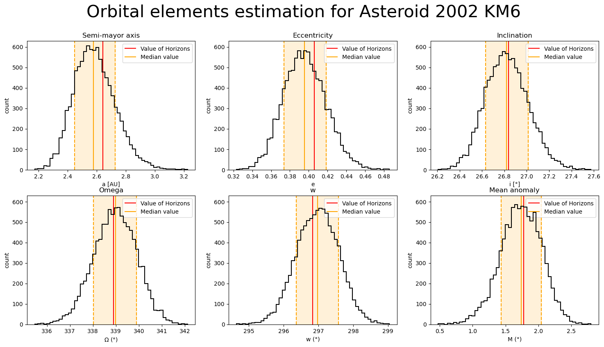

# WhereIsMyRock
This repository hosts an implementation of the Gauss method for orbital determination. In addition, this repository has a collection of testing scenarios designed to evaluate the algorithm's performance and robustness. Through testing and analysis, the limitations of the algorithm are explored.

